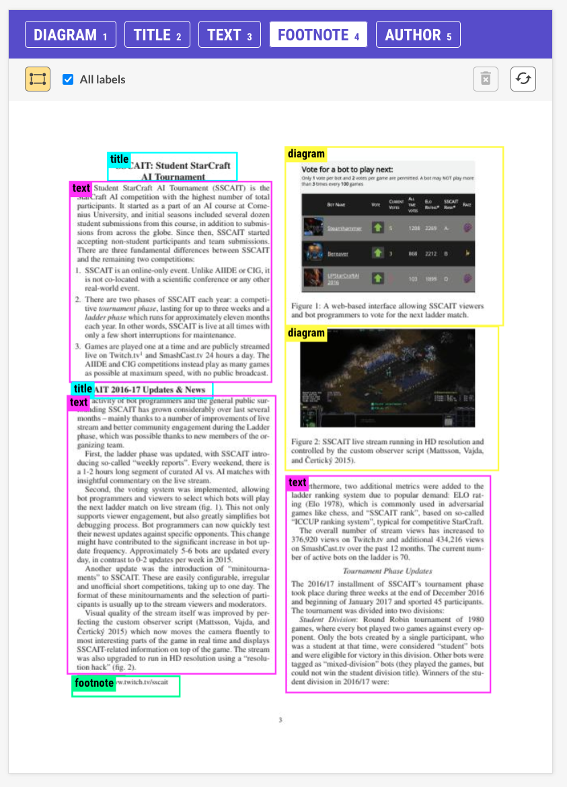

# prodigy-pdf

A Prodigy plugin for PDF annotation

## `pdf.image.manual`

This recipe turns pdfs into images so that they may be annotated using the familiar [image_manual](https://prodi.gy/docs/recipes#image-manual) interface. 

<details>
    <summary>UI Preview</summary>
    


</details>

#### Usage:

```
prodigy pdf.image.manual papers tests/pdfs --labels title,text,figure
```
